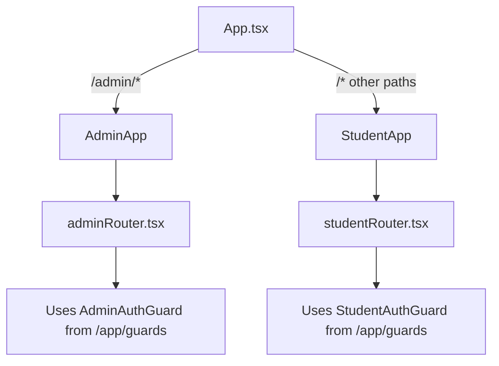

# 🏗️ Bassant Elqenawy Educational Platform - Project Structure & Reference Guide

## 🚨 MANDATORY ARCHITECTURAL RULES

> [!IMPORTANT]
> These rules are non-negotiable to maintain code quality and architectural integrity.

1.  **Server State MUST use React Query**
    - **Never** store API data in Redux, Zustand, or Context.
    - All data fetching, caching, and synchronization is handled by React Query custom hooks (e.g., `useCoursesQuery`, `useLoginMutation`).
    - API functions (in `api/` folders) should **never** be called directly by components. They are implementation details for React Query hooks.

2.  **Redux is STRICTLY for Client State**
    - Use Redux **only** for global client-side state (e.g., Auth tokens, User session, Theme).
    - Do not pollute the Redux store with server response data.

3.  **Strict Feature Isolation**
    - Features should be self-contained.
    - New features **must** include a `queries` folder if they fetch data.
    - Imports should be strict: do not reach deep into other features' internal helper functions. Use the public exports from `index.ts`.

4.  **No "Loose" API Calls**
    - All API interactions must flow through: `Component` -> `Custom Query Hook` -> `API Function` -> `Http Client`.
    - No direct `axios` or `fetch` calls in components.

---

**Last Updated:** 2026-01-03  
**Version:** 2.0

This comprehensive guide provides architectural insights, folder structure documentation, and development guidelines for the Bassant Elqenawy Educational Platform. Use this as a reference when building new features or understanding the existing codebase.

---

## 📋 Table of Contents

1. [Architecture Overview](#architecture-overview)
2. [Client-Side Architecture](#client-side-architecture)
3. [Technology Stack](#technology-stack)
4. [Detailed Folder Structure](#detailed-folder-structure)
5. [Feature Modules](#feature-modules)
6. [Routing Architecture](#routing-architecture)
7. [State Management](#state-management)
8. [API Integration Patterns](#api-integration-patterns)
9. [Development Guidelines](#development-guidelines)

---

## 🎯 Architecture Overview

The Bassant Elqenawy Educational Platform is a **multi-tenant** web application built with a **feature-based architecture** and **app-based routing**. It supports two distinct user roles:

- **Student App**: Learning management, course access, subscription management
- **Admin App**: User management, content administration, analytics

### Key Architectural Principles

1. **Feature-Based Organization**: Domain logic grouped by business features (Auth, Courses, Grades, etc.)
2. **App Isolation**: Separate entry points for Student and Admin applications
3. **Component Reusability**: Shared UI components across applications
4. **Type Safety**: Full TypeScript implementation throughout the stack
5. **Scalability**: Modular structure supporting easy feature additions

---

## 💻 Client-Side Architecture

### Framework & Build Tools

- **Framework**: React 18.2 with TypeScript
- **Build Tool**: Vite 5.0
- **Routing**: React Router DOM v6
- **Styling**: Tailwind CSS with custom design system

### Architecture Pattern

```
Multi-App Architecture
├── Student Application (Public + Authenticated Routes)
├── Admin Application (Authenticated Only)
└── Shared Components & Features
```

---

## 🛠️ Technology Stack

### Core Dependencies

| Category | Technology | Version | Purpose |
|----------|-----------|---------|---------|
| **Framework** | React | 18.2.0 | UI library |
| **Language** | TypeScript | 5.2.2 | Type safety |
| **State Management** | Redux Toolkit | 2.11.2 | Global state |
| | Zustand | 4.4.7 | Lightweight state |
| **Routing** | React Router DOM | 6.21.3 | Client-side routing |
| **HTTP Client** | Axios | 1.13.2 | API communication |
| **Internationalization** | i18next | 25.7.3 | Multi-language support |
| | react-i18next | 16.5.0 | React i18n bindings |
| **UI Components** | Radix UI | Various | Accessible primitives |
| | Lucide React | 0.344.0 | Icon library |
| **Animations** | Framer Motion | 12.23.26 | UI animations |
| **Styling** | Tailwind CSS | 3.4.0 | Utility-first CSS |
| **Notifications** | React Hot Toast | 2.6.0 | Toast notifications |

### Development Tools

- **Linting**: ESLint with React plugins
- **Build**: Vite with TypeScript compilation
- **CSS Processing**: PostCSS + Autoprefixer

---

## 📂 Detailed Folder Structure

### Root Structure

```
client/
├── src/                      # Source code
│   ├── app/                  # Application infrastructure (guards, shared utils)
│   ├── apps/                 # Application modules (Student, Admin)
│   ├── features/             # Feature modules (domain logic)
│   ├── components/           # Shared UI components
│   ├── lib/                  # Core utilities & services
│   ├── store/                # Global Redux store
│   ├── hooks/                # Global custom hooks
│   ├── locales/              # i18n translation files
│   ├── styles/               # Global styles
│   └── assets/               # Static assets
├── public/                   # Public static files
├── PROJECT_STRUCTURE.md      # This documentation
├── package.json              # Dependencies
└── vite.config.ts            # Vite configuration
```

### Understanding `/app` vs `/apps`

> **Important Distinction:** The project has TWO similarly-named folders with different purposes

#### `/src/app/` (Singular) - **Application Infrastructure**

**Purpose:** Shared application infrastructure and utilities

```
app/
└── guards/                   # Route guards (authentication/authorization)
    ├── StudentAuthGuard.tsx  # Protects student routes
    ├── AdminAuthGuard.tsx    # Protects admin routes
    └── SubscriptionGuard.tsx # Checks subscription status
```

**Think of it as:** The "plumbing" - shared infrastructure used by all applications

---

#### `/src/apps/` (Plural) - **Application Modules**

**Purpose:** Individual, self-contained applications

```
apps/
├── student/                  # Student application
│   ├── StudentApp.tsx        # Entry point
│   ├── studentRouter.tsx     # Routes configuration
│   ├── pages/                # Student pages
│   ├── layouts/              # Student layouts
│   └── components/           # Student-specific components
│
└── admin/                    # Admin application
    ├── AdminApp.tsx          # Entry point
    ├── adminRouter.tsx       # Routes configuration
    ├── pages/                # Admin pages
    ├── layouts/              # Admin layouts
    └── components/           # Admin-specific components
```

**Think of it as:** The "features" - actual application implementations

---

#### How They Work Together



**Routing Flow:**
1. `App.tsx` checks the URL path
2. Routes to `AdminApp` for `/admin/*` paths
3. Routes to `StudentApp` for all other paths
4. Each app uses its own router (`adminRouter.tsx` or `studentRouter.tsx`)
5. Routers use guards from `/app/guards/` to protect routes

---

## 🏢 Apps Directory (`/src/apps/`)

### Student Application (`/apps/student/`)

**Entry Point**: `StudentApp.tsx`  
**Router**: `studentRouter.tsx`

```
student/
├── StudentApp.tsx            # Student app root component
├── studentRouter.tsx         # Student routes configuration
├── components/               # Student-specific components
├── layouts/                  # Student layouts
│   ├── PublicLayout.tsx      # For landing/auth pages
│   └── StudentLayout.tsx     # For authenticated student pages
└── pages/                    # Student page components
    ├── Auth/                 # Authentication pages
    │   ├── Login.tsx
    │   ├── Register.tsx
    │   ├── VerifyOtp.tsx
    │   ├── ForgotPassword.tsx
    │   └── ResetPassword.tsx
    ├── landing/              # Landing page
    │   └── LandingPage.tsx
    ├── dashboard/            # Student dashboard
    │   └── Dashboard.tsx
    ├── Profile/              # User profile management
    │   └── Profile.tsx
    ├── Grades/               # Grade selection/browsing
    │   └── index.tsx
    ├── LessonsList/          # Course lessons listing
    │   └── index.tsx
    ├── Lessons/              # Lesson viewer & saved lessons
    │   ├── Lesson.tsx
    │   └── SavedLessons.tsx
    ├── Subscription/         # Subscription management
    │   ├── Subscribe.tsx
    │   └── WaitingConfirmation.tsx
    └── NotFound/             # 404 error page
        └── NotFound.tsx
```

**Student Routes**:

| Route | Component | Auth Required | Description |
|-------|-----------|---------------|-------------|
| `/` | LandingPage | No | Public landing page |
| `/auth/login` | Login | No | Student login |
| `/auth/register` | Register | No | Student registration |
| `/auth/verify-otp` | VerifyOtp | No | OTP verification |
| `/auth/forgot-password` | ForgotPassword | No | Password reset request |
| `/auth/reset-password` | ResetPassword | No | Password reset form |
| `/student/dashboard` | Dashboard | Yes | Student dashboard |
| `/student/profile` | Profile | Yes | Profile management |
| `/student/grades` | GradesList | Public/Auth | Grade browsing |
| `/student/lessons` | LessonsList | Yes | Course lessons |
| `/student/lesson/:id` | LessonPage | Yes | Lesson viewer |
| `/student/saved-lessons` | SavedLessons | Yes | Saved lessons |
| `/student/subscribe` | Subscribe | Yes | Subscription page |
| `/student/subscription/waiting-confirmation` | WaitingConfirmation | Yes | Subscription pending |

---

### Admin Application (`/apps/admin/`)

**Entry Point**: `AdminApp.tsx`  
**Router**: `adminRouter.tsx`

```
admin/
├── AdminApp.tsx              # Admin app root component
├── adminRouter.tsx           # Admin routes configuration
├── components/               # Admin-specific components
│   └── AdminSidebar.tsx      # Admin navigation sidebar
├── layouts/                  # Admin layouts
│   └── AdminLayout.tsx       # Main admin layout
└── pages/                    # Admin page components
    ├── auth/                 # Admin authentication
    │   └── Login.tsx
    ├── Dashboard/            # Admin dashboard
    │   └── Dashboard.tsx
    ├── students/             # Student management
    │   ├── Students.tsx      # Student listing
    │   └── StudentDetails.tsx # Student details view
    └── DeletedItems/         # Soft-deleted items management
        └── DeletedItems.tsx
```

**Admin Routes**:

| Route | Component | Auth Required | Description |
|-------|-----------|---------------|-------------|
| `/admin/login` | Login | No | Admin login |
| `/admin/dashboard` | Dashboard | Yes | Admin dashboard |
| `/admin/students` | Students | Yes | Student management |
| `/admin/students/:id` | StudentDetails | Yes | Student detail view |
| `/admin/deleted-items` | DeletedItems | Yes | Manage soft-deleted items |

---

## 🎨 Components Directory (`/src/components/`)

Shared, reusable UI components used across both applications.

```
components/
├── layout/                   # Layout components
│   ├── Header.tsx            # App header
│   ├── Footer.tsx            # App footer
│   ├── Sidebar.tsx           # Generic sidebar
│   └── ...
└── ui/                       # UI primitives (Shadcn components)
    ├── button.tsx            # Button component
    ├── input.tsx             # Input component
    ├── dialog.tsx            # Dialog/Modal component
    ├── select.tsx            # Select dropdown
    ├── alert-dialog.tsx      # Alert dialog
    ├── tooltip.tsx           # Tooltip component
    ├── badge.tsx             # Badge component
    ├── skeleton.tsx          # Loading skeleton
    └── ...
```

**Design System**: Based on **Shadcn UI** with Radix UI primitives and Tailwind CSS styling.

---

## ⚡ Features Directory (`/src/features/`)

Domain-driven feature modules containing business logic, API calls, and feature-specific components.

```
features/
├── Auth/                     # Authentication & authorization
│   ├── api/
│   │   ├── auth.api.ts       # Auth API endpoints
│   │   └── profile.api.ts    # Profile API endpoints
│   ├── components/
│   │   ├── LoginForm/
│   │   ├── RegisterForm/
│   │   ├── OtpForm/
│   │   └── ...
│   ├── hooks/
│   │   ├── useAuth.tsx       # Auth hook
│   │   ├── useLogin.tsx      # Login logic
│   │   └── useRegister.tsx   # Registration logic
│   ├── store/
│   │   ├── studentAuth.slice.ts
│   │   ├── adminAuth.slice.ts
│   │   └── index.ts
│   ├── types.ts              # Auth-related types
│   └── index.ts              # Public exports
│
├── courses/                  # Course management
│   ├── api/
│   │   └── courses.api.ts
│   ├── components/
│   │   └── CourseCard.tsx
│   ├── types.ts
│   └── index.ts
│
├── grades/                   # Grade/level management
│   ├── api/
│   │   └── grades.api.ts
│   ├── types.ts
│   └── index.ts
│
├── Lessons/                  # Lesson content management
│   ├── api/
│   │   ├── lessons.api.ts
│   │   └── savedLessons.api.ts
│   ├── components/
│   │   ├── LessonContent/
│   │   ├── LessonViewer/
│   │   └── ...
│   ├── hooks/
│   │   ├── useLessons.tsx
│   │   └── useSavedLessons.tsx
│   ├── types.ts
│   └── index.ts
│
├── user/                     # User management
│   ├── api/
│   │   └── admin-users.api.ts
│   ├── types.ts
│   └── index.ts
│
├── Subscription/             # Subscription management
│   ├── api/
│   │   └── subscription.api.ts
│   ├── components/
│   │   ├── SubscriptionForm/
│   │   └── ...
│   ├── hooks/
│   │   └── useSubscription.tsx
│   ├── types.ts
│   └── index.ts
│
├── Dashboard/                # Dashboard widgets
│   ├── components/
│   │   ├── StatsCard/
│   │   └── ...
│   ├── types.ts
│   └── index.ts
│
└── promo-codes/              # Promo code functionality
    └── types.ts
```

### Feature Module Pattern

Each feature follows a consistent structure:

```
[FeatureName]/
├── api/                      # API service calls (Pure functions)
│   └── [feature].api.ts
├── queries/                  # React Query Hooks (The Public Interface)
│   ├── use[Feature]Query.tsx
│   └── use[Feature]Mutation.tsx
├── components/               # Feature-specific UI
│   └── [Component]/
├── hooks/                    # Feature behavior hooks (non-data fetching)
│   └── use[Feature]Logic.tsx
├── store/                    # Redux slice (Strictly for client state)
│   └── [feature].slice.ts
├── types.ts                  # TypeScript interfaces
└── index.ts                  # Public exports
```

---

## 🔌 API Integration Patterns

### Hybrid Architecture

The project uses a **Hybrid Approach** for API organization, balancing modularity with convenience.

1.  **Source of Truth (Feature-Based)**: 
    Actual API implementations live inside their respective feature folders.
    `src/features/[Feature]/api/[feature].api.ts`

2.  **Convenience Layer (Global)**:
    A centralized barrel file re-exports all APIs for easy access.
    `src/api/index.ts`

### How to Import

You have two options when importing APIs:

**Option A: Global Import (Convenience)**
Best for pages or components that need data from multiple features.
```typescript
import { studentAuthApi, gradesApi } from '@/api';
```

**Option B: Feature Import (Direct)**
Best for strict modularity or when working within the feature itself.
```typescript
import * as studentAuthApi from '@/features/Auth/api/student-auth.api';
```

### HTTP Client Configuration

**Location**: `/src/lib/http-client.ts`

The application uses a custom Axios wrapper with:
- Automatic token injection
- Request/response interceptors
- Error handling middleware
- Base URL configuration

**Example API Call**:

```typescript
// features/Auth/api/auth.api.ts
import { httpClient } from '@/lib/http-client';

export const login = async (credentials: LoginCredentials) => {
  const { data } = await httpClient.post('/auth/login', credentials);
  return data;
};
```

### API Module Structure

Each feature's `api/` folder contains:
- Type-safe API functions
- Request/response type definitions
- Error handling

**Naming Convention**: `[feature].api.ts`

---

## 🗄️ State Management

### Redux Store Configuration

**Location**: `/src/store/index.ts`

```typescript
store = {
  studentAuth: studentAuthReducer,  // Student authentication state
  adminAuth: adminAuthReducer,      // Admin authentication state
}
```

**Middleware**:
- `studentAuthPersistenceMiddleware`: Persists student auth to localStorage
- `adminAuthPersistenceMiddleware`: Persists admin auth to localStorage

### State Management Strategy

| State Type | Solution | Use Case | RULES |
|------------|----------|----------|-------|
| **Server State** | **React Query** | API data, caching, revalidation | ✅ **MANDATORY** for all API data |
| **Global Client State** | **Redux Toolkit** | Auth token, User session | ✅ Use sparingly for widely shared data |
| **Feature State** | **Zustand** | Complex local feature logic | ⚠️ Optional, prefer local state |
| **UI State** | **useState / useReducer** | Form inputs, toggles, modals | ✅ Default for component-local state |

### Custom Hooks

**Location**: `/src/store/hooks.ts`

```typescript
export const useAppDispatch = () => useDispatch<AppDispatch>();
export const useAppSelector: TypedUseSelectorHook<RootState> = useSelector;
```

---

## 🧭 Routing Architecture

### Route Guards

**Location**: `/src/app/guards/`

| Guard | Purpose |
|-------|---------|
| `StudentAuthGuard.tsx` | Protects student routes, redirects to login if unauthenticated |
| `AdminAuthGuard.tsx` | Protects admin routes, validates admin role |

### Routing Pattern

```typescript
// studentRouter.tsx
<Routes>
  {/* Public Routes */}
  <Route element={<PublicLayout />}>
    <Route path="/" element={<LandingPage />} />
    {/* ... */}
  </Route>

  {/* Protected Routes */}
  <Route path="/student" element={<StudentAuthGuard><StudentLayout /></StudentAuthGuard>}>
    <Route path="dashboard" element={<Dashboard />} />
    {/* ... */}
  </Route>
</Routes>
```

---

## 🌍 Internationalization (i18n)

### Configuration

**Location**: `/src/i18n.ts`

**Supported Languages**:
- English (en)
- Arabic (ar)

**Translation Files**:
- `/src/locales/en.json`
- `/src/locales/ar.json`

### Usage

```typescript
import { useTranslation } from 'react-i18next';

const Component = () => {
  const { t, i18n } = useTranslation();
  
  return (
    <div>
      <h1>{t('welcome.title')}</h1>
      <button onClick={() => i18n.changeLanguage('ar')}>
        {t('switchLanguage')}
      </button>
    </div>
  );
};
```

---

## 🎨 Styling & Design System

### Tailwind Configuration

**Location**: `tailwind.config.js`

**Custom Theme Variables**: Defined in `/src/styles/globals.css`

```css
:root {
  --primary: ...;
  --secondary: ...;
  --soft-sage: rgb(114, 155, 119);
  /* ... */
}
```

### Component Styling

- **Base**: Tailwind utility classes
- **Components**: Shadcn UI with CVA (Class Variance Authority)
- **Animations**: Framer Motion for complex interactions

---

## 📘 Development Guidelines

### How to Add New Elements

#### 1️⃣ Adding a New Page

##### Student Page

1. **Create Component**: `src/apps/student/pages/[PageName]/index.tsx`
2. **Register Route**: Update `src/apps/student/studentRouter.tsx`

```typescript
import MyPage from './pages/MyPage';

// Inside <Route path="/student" ...>
<Route path="my-page" element={<MyPage />} />
```

3. **Result URL**: `http://localhost:3000/student/my-page`

##### Admin Page

1. **Create Component**: `src/apps/admin/pages/[PageName]/[PageName].tsx`
2. **Register Route**: Update `src/apps/admin/adminRouter.tsx`

```typescript
import MyAdminPage from './pages/MyAdminPage';

// Inside <Route path="/admin" ...>
<Route path="my-admin-page" element={<MyAdminPage />} />
```

3. **Result URL**: `http://localhost:3000/admin/my-admin-page`

---

#### 2️⃣ Adding a New Component

**Decision Tree**:

```
Is it used across multiple apps/features?
├─ YES → src/components/
│
└─ NO → Is it feature-specific?
    ├─ YES → src/features/[Feature]/components/
    │
    └─ NO → Is it app-specific?
        ├─ Student → src/apps/student/components/
        └─ Admin → src/apps/admin/components/
```

**Example**: Creating a `GradeCard` component

```bash
# Feature-specific component
src/features/grades/components/GradeCard.tsx
```

---

#### 3️⃣ Adding a New Feature Module

1. **Create Structure**:

```bash
src/features/[NewFeature]/
├── api/                      # (Internal) API definitions
│   └── [feature].api.ts
├── queries/                  # (Public) React Query hooks
│   ├── use[Feature]Query.ts
│   └── use[Feature]Mutation.ts
├── components/               # Components
│   └── [Component]/
├── hooks/                    # Logic hooks
│   └── use[Feature].tsx
├── store/                    # Global client state only
│   └── [feature].slice.ts
├── types.ts
└── index.ts
```

2. **Define API**:

```typescript
// api/[feature].api.ts
import { httpClient } from '@/lib/http-client';

export const getSomething = async () => {
  const { data } = await httpClient.get('/endpoint');
  return data;
};
```

3. **Create Types**:

```typescript
// types.ts
export interface Something {
  id: string;
  name: string;
}
```

4. **Export Publicly**:

```typescript
// index.ts
export * from './api/[feature].api';
export * from './components/[Component]';
export * from './hooks/use[Feature]';
export type * from './types';
```

5. **(Optional) Add Redux Slice**:

```typescript
// store/[feature].slice.ts
import { createSlice } from '@reduxjs/toolkit';

const featureSlice = createSlice({
  name: 'feature',
  initialState: {},
  reducers: {},
});

export const featureReducer = featureSlice.reducer;
```

6. **Register in Store**:

```typescript
// src/store/index.ts
import { featureReducer } from '@/features/[Feature]/store';

export const store = configureStore({
  reducer: {
    // ...
    feature: featureReducer,
  },
});
```

---

#### 4️⃣ Adding Data Fetching (The React Query Way)

1.  **Define API Function** (`src/features/[Feature]/api/`):
    - Create the raw axios call.

2.  **Create Query Hook** (`src/features/[Feature]/queries/`):
    - Wrap the API call in `useQuery` or `useMutation`.

3.  **Consume in Component**:
    - Use the hook, handle `isLoading` and `error` states.

**Example**:

```typescript
// 1. API (internal)
// features/Courses/api/courses.api.ts
export const getCourses = async () => { ... }

// 2. Query Hook (public)
// features/Courses/queries/useCoursesQuery.ts
export const useCoursesQuery = () => {
return useQuery({
queryKey: ['courses'],
queryFn: getCourses
});
}

// 3. Component
// features/Courses/components/CourseList.tsx
const { data, isLoading } = useCoursesQuery();
```

---

#### 5️⃣ Adding an API Call (Legacy / Low-Level)

1. **Navigate to**: `src/features/[Feature]/api/`
2. **Create/Edit**: `[feature].api.ts`
3. **Implement**:

```typescript
import { httpClient } from '@/lib/http-client';

export const fetchData = async (params: Params) => {
  const { data } = await httpClient.get('/endpoint', { params });
  return data;
};

export const createData = async (payload: CreatePayload) => {
  const { data } = await httpClient.post('/endpoint', payload);
  return data;
};
```

---

#### 5️⃣ Adding a Custom Hook

**Location Decision**:
- **Global Logic**: `src/hooks/` (e.g., `useWindowSize`, `useDebounce`)
- **Feature Logic**: `src/features/[Feature]/hooks/` (e.g., `useGrades`, `useCourseProgress`)

**Example**:

```typescript
// src/features/Auth/hooks/useAuth.tsx
import { useAppSelector } from '@/store/hooks';

export const useAuth = () => {
  const { user, token } = useAppSelector((state) => state.studentAuth);
  
  return {
    isAuthenticated: !!token,
    user,
  };
};
```

---

#### 6️⃣ Adding Localization Keys

1. **Open**:
   - `src/locales/en.json`
   - `src/locales/ar.json`

2. **Add Key-Value Pairs**:

```json
// en.json
{
  "myFeature": {
    "title": "My Feature Title",
    "description": "Feature description"
  }
}

// ar.json
{
  "myFeature": {
    "title": "عنوان الميزة",
    "description": "وصف الميزة"
  }
}
```

3. **Use in Component**:

```typescript
const { t } = useTranslation();
<h1>{t('myFeature.title')}</h1>
```

---

#### 7️⃣ Adding Shared UI Component (Shadcn)

1. **Check**: `components.json` for Shadcn config
2. **Install Component**: (if using CLI)

```bash
npx shadcn-ui@latest add [component-name]
```

3. **Location**: Components added to `src/components/ui/`

4. **Customize**: Modify styling in component file using Tailwind classes

---

### Code Style Guidelines

#### TypeScript Best Practices

✅ **Do**:
- Use explicit types for function parameters and returns
- Define interfaces/types in `types.ts` files
- Use type imports: `import type { User } from './types'`

❌ **Don't**:
- Use `any` type
- Ignore TypeScript errors with `@ts-ignore` without comments

#### Component Structure

```typescript
// Imports
import React from 'react';
import { useTranslation } from 'react-i18next';

// Types
interface MyComponentProps {
  title: string;
  onAction: () => void;
}

// Component
export const MyComponent: React.FC<MyComponentProps> = ({ title, onAction }) => {
  const { t } = useTranslation();
  
  return (
    <div>
      <h1>{title}</h1>
      <button onClick={onAction}>{t('action')}</button>
    </div>
  );
};
```

#### File Naming Conventions

| File Type | Convention | Example |
|-----------|-----------|---------|
| **Component** | PascalCase | `GradeCard.tsx` |
| **Hook** | camelCase with `use` prefix | `useAuth.tsx` |
| **API** | camelCase with `.api` suffix | `grades.api.ts` |
| **Type** | PascalCase interface/type | `types.ts` |
| **Store** | camelCase with `.slice` suffix | `auth.slice.ts` |
| **Util** | camelCase | `userUtils.ts` |

---

## 🎯 Common Patterns & Best Practices

### Authentication Flow

```typescript
// 1. Login
const { data } = await login(credentials);
dispatch(setCredentials(data)); // Stores token + user

// 2. Protected Route Access
<StudentAuthGuard> ← Checks for token
  <StudentLayout />
</StudentAuthGuard>

// 3. API Calls with Auth
httpClient.get('/user') // Automatically includes token in header
```

### Error Handling

```typescript
try {
  const data = await apiCall();
  toast.success('Success message');
} catch (error) {
  toast.error(error.response?.data?.message || 'An error occurred');
}
```

### Form Validation

- **Simple Forms**: Use controlled components with local state
- **Complex Forms**: Consider React Hook Form (not yet implemented)

---

## 🚀 Running the Application

### Development Mode

```bash
npm run dev
```

**Vite Dev Server**: `http://localhost:5173` (or configured port)

### Build for Production

```bash
npm run build
```

**Output**: `dist/` folder

### Preview Production Build

```bash
npm run preview
```

---

## 📦 Build & Deployment

### Environment Variables

**Location**: `.env`

Key variables (examples):
```env
VITE_API_BASE_URL=http://localhost:3000
# Add other env vars as needed
```

**Access in Code**:
```typescript
const apiUrl = import.meta.env.VITE_API_BASE_URL;
```

---

## 🔍 Key Files Reference

| File | Purpose |
|------|---------|
| `src/App.tsx` | Root application component |
| `src/main.tsx` | Application entry point |
| `src/store/index.ts` | Redux store configuration |
| `src/lib/http-client.ts` | Axios HTTP client setup |
| `src/i18n.ts` | i18n configuration |
| `src/styles/globals.css` | Global styles & Tailwind directives |
| `vite.config.ts` | Vite build configuration |
| `tsconfig.json` | TypeScript configuration |
| `tailwind.config.js` | Tailwind CSS configuration |

---

## 📚 Additional Resources

### Existing Features

#### Student Features
- ✅ Authentication (Login, Register, OTP, Password Reset)
- ✅ Landing Page with grade browsing
- ✅ Dashboard
- ✅ Profile Management with grade selection
- ✅ Grade & Course browsing
- ✅ Lesson viewing
- ✅ Saved Lessons
- ✅ Subscription management
- ✅ Waiting confirmation workflow

#### Admin Features
- ✅ Admin authentication
- ✅ Dashboard
- ✅ Student management (list, view details)
- ✅ Soft-delete management (DeletedItems)
- ✅ Pagination support

### UI Enhancements
- ✅ Framer Motion animations on landing/grades pages
- ✅ Skeleton loading states
- ✅ RTL/LTR language support
- ✅ Shadcn UI components integration
- ✅ Toast notifications

---

## 🎨 Design Philosophy

### Modern UI Principles

1. **Premium Aesthetics**: Glassmorphism, gradients, smooth animations
2. **Responsive Design**: Mobile-first approach
3. **Accessibility**: Radix UI primitives for ARIA compliance
4. **Performance**: Optimized animations with Framer Motion
5. **Consistency**: Shared design tokens via Tailwind config

---

## 📝 Notes for Developers

### Before Starting Work

1. Review this document to understand the architecture
2. Check existing features to avoid duplication
3. Follow the established patterns for consistency
4. Use TypeScript strictly—no `any` types
5. Add translations for all user-facing text

### When Building New Features

1. **Plan First**: Determine if it's a new feature module or extends existing
2. **Follow Structure**: Use the feature module pattern
3. **Type Everything**: Define types in `types.ts`
4. **Export Cleanly**: Use `index.ts` for public API
5. **Test Manually**: Verify both desktop and mobile views
6. **i18n**: Add translations in both `en.json` and `ar.json`

### Code Review Checklist

- [ ] TypeScript types defined properly
- [ ] No `any` types (unless absolutely necessary with comment)
- [ ] Component properly located (app/feature/shared)
- [ ] Translations added for en/ar
- [ ] Code follows established patterns
- [ ] No hardcoded strings in UI
- [ ] Responsive design tested
- [ ] Error handling implemented

---

**End of Documentation**

*For questions or clarifications, refer to recent conversation history or consult with the development team.*